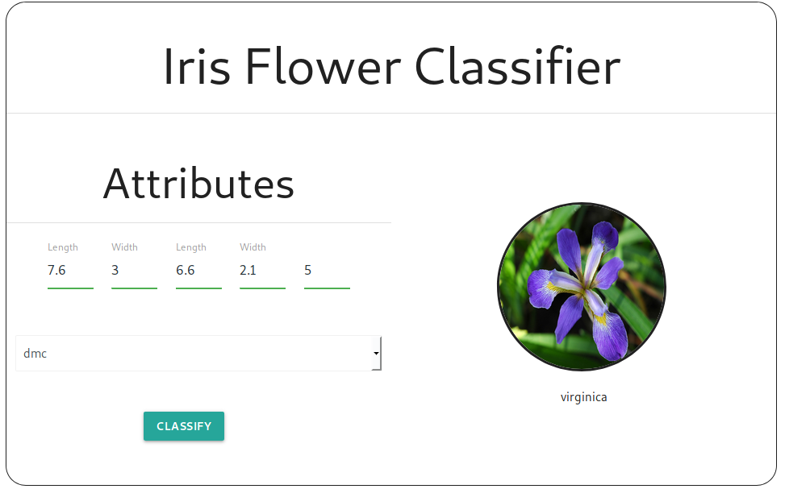

# 8-Puzzle

This program implement a classic iris flower classifier using nn, knn and dmc algorithms. This is part of an exercise from computational intelligence class.

```
The Iris flower data set or Fisher's Iris data set is a multivariate 
data set introduced by the British statistician and biologist Ronald 
Fisher in his 1936 paper The use of multiple measurements in taxonomic 
problems as an example of linear discriminant analysis.
```

## How to run

Just click in index.html in src folder

<p align="center">
	<a href="">
		
	</a>
</p>

